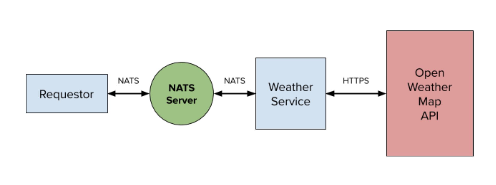

# A Simple .NET Microservice written in C#

This is a simple example of a scalable .NET microservice using [NATS](https://nats.io).  In this example service,
we'll serve weather data from [OpenWeatherMap.org](https://openweathermap.org/) to NATS clients.  Data will be cached
for a short period of time to lower latency, providing a better quality of service.

## Requirements for this example

- [.NET Core](https://dotnet.microsoft.com/download) 3.1 or higher.
- [Docker](https://docker.com) or a version of nats-req from NATS examples.
- A NATS server
- A OpenWeatherMap.org API key

It takes about 2 minutes to [signup](https://home.openweathermap.org/users/sign_up)
and create an OpenWeatherMap [api key](https://home.openweathermap.org/api_keys).

## Design

Pretty straightforward.  A weather service in the form of a NATS client listens to
requests that contain a location and reply over NATS with the current weather for
that location.



### SimpleWeatherService

The simple weather service design is straightforward.  We create a connection to NATS, listen to requests on the `weather.current` subject,
and when we receive requests we serve up the data.  This is achieved using the [request/reply](https://docs.nats.io/nats-concepts/reqreply)
pattern with a [queue subscription](https://docs.nats.io/nats-concepts/queue) used here to enable scaling. For bonus points,
the `Drain()` API is used at exit to gracefully handle incoming requests.  This is a good thing to do if you plan to scale down or
support rolling upgrades.

Note, in order to scale up the **only** thing you have to do is launch another instance. NATS will do the rest with zero
configuration changes.

There are just three things we do with NATS in our service.

1) Setup options and connect
2) Subscribe and provide a handler to process messages
3) Drain on exit *(optional but good practice)*

Take a look at the [code](./SimpleWeatherService/Program.cs).  It is documented to describe what is happening when, and why.

Usage:  `dotnet run -p SimpleWeatherService <Required API key> --url <NATS url> --creds <NATS Credentials>`

The only required parameter is the API key.

### SimpleWeatherRequestor

The requestor simply creates a connection to the NATS server, makes a request containing a location and then prints the results
to stdout.  The location will default to your IP's location as determined by [ipapi](https://ipapi.co).

The requestor is even simpler.

1) Setup options and connect
2) Request data for your location

Here is the NATS code:

```csharp
    using var nc = new ConnectionFactory().CreateConnection(opts);
    var response = nc.Request("weather.current", CheckDefaultLocation(location), 5000);
```

The request payload is a string representing a location, which can be a latitude/longitude (e.g. "-105.01,39.54") or a city name (e.g. "Denver").  Check out https://openweathermap.org/current for locations.

Usage:  `dotnet run -p SimpleWeatherRequestor --location <city name or lat,long> --url <NATS url> --creds <NATS Credentials>`

### Starting the NATS server

There are a few options.  You can run locally with docker, connect to `demo.nats.io`, or connect to [NGS](https://synadia.com/ngs).
There's plenty of documentation [here](https://docs.nats.io/nats-server/installation).  If you use `demo.nats.io` I'd suggest altering
the subject used.

One way to launch the NATS server is through docker.

`$ docker run --rm -p 4222:4222 nats`
 
If you are using default ports the NATS url is simply the IP address of your computer.

## Testing

First, I'll get my IP.  Depending on your system, you may need to use a different API.

```text
$ ipconfig getifaddr en1
192.168.0.29
```

Here we start our service.  From the repository directory, run the
following using your IP instead of mine.

```text
$ dotnet run -p SimpleWeatherService <your api key here> --url 192.168.0.29
Connected and listening for requests.
```

Now we'll run the service requestor to make a request:
```text
$ dotnet run -p SimpleWeatherRequestor --url 192.168.0.29
{"coord":{"lon":-105.01,"lat":39.54},"weather":[{"id":800,"main":"Clear","description":"clear sky","icon":"01d"}],"base":"stations","main":{"temp":270.84,"feels_like":263.08,"temp_min":264.82,"temp_max":275.37,"pressure":1023,"humidity":34},"visibility":16093,"wind":{"speed":6.2,"deg":110},"clouds":{"all":1},"dt":1582066157,"sys":{"type":1,"id":3958,"country":"US","sunrise":1582033747,"sunset":1582072750},"timezone":-25200,"id":5425043,"name":"Highlands Ranch","cod":200}
```

There we go...  weather data from a scalable .NET service!  To scale the back end just launch more SimpleWeatherService instances.

## Building the Project

If you prefer to run the binaries directly, build with dotnet from the repository directory or
use Visual Studio with `SimpleWeatherService.sln`.

```text
$ dotnet build
```

## Using NGS

This will be even simpler than runnging your own server, and more secure than using `demo.nats.io`.

Setup a [free NGS account](https://synadia.com/ngs/signup) and pass your user credentials into the 
service and requestor.  A free NGS account takes only a minute to setup.

Here's an example:

```text
$ dotnet run -p SimpleWeatherService <your API key> --url connect.ngs.global --creds ~/.nkeys/creds/synadia/First/First.creds
```

```text
$ dotnet run -p SimpleWeatherRequestor --url connect.ngs.global --creds ~/.nkeys/creds/synadia/First/First.creds
{"coord":{"lon":-105.01,"lat":39.54},"weather":[{"id":804,"main":"Clouds","description":"overcast clouds","icon":"04n"}],"base":"stations","main":{"temp":267.96,"feels_like":263,"temp_min":263.15,"temp_max":272.15,"pressure":1024,"humidity":63},"visibility":16093,"wind":{"speed":2.6,"deg":150},"clouds":{"all":90},"dt":1582081056,"sys":{"type":1,"id":3958,"country":"US","sunrise":1582033747,"sunset":1582072750},"timezone":-25200,"id":5425043,"name":"Highlands Ranch","cod":200}
```

## Enjoy!

For more on NATS in .NET, check out the NATS .NET client [here](https://github.com/nats-io/nats.net).
